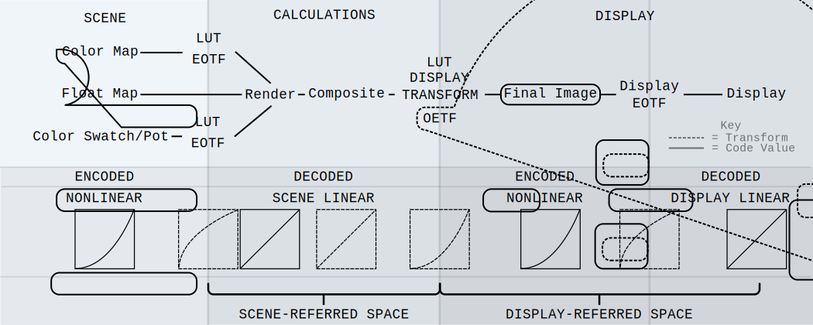

# Color Management

This research is an attempt for me to better understand color management in an animation pipeline. This document will be ongoing, as my understanding and research grows. That being said, I do not claim that anything on this document is perfect, or even correct; it is simply my best understanding of said topics. 

I hope this will be a resource to others. Please reach out if you have any feedback or areas of correction.

> **_NOTE:_** This repo also serves as a storage location for useful [OCIO](./doc/Glossary.md/#opencolorio-ocio) configurations in an animation pipeline. See [OCIO Page](./doc/OCIO.md) for further clarification on [OCIO](./doc/Glossary.md/#opencolorio-ocio) configurations.

## Table of Contents
- [Color Management Workflow](./doc/CMW.md)
    - [Color Space](./doc/ColorSpace.md)
    - [Transfer Functions](./doc/TransferFunctions.md)
    - [Display Transform](./doc/DisplayTransform.md)
    - [LUT](./doc/LUT.md)
- Frameworks:
    - [OCIO](./doc/OCIO.md)
    - [ACES](./doc/ACES.md)
- Other Useful Topics:
    - [Light Intensity](./doc/OtherTopics/LightIntensity.md)
- Appendix:
    - [Glossary](./doc/Glossary.md)
    - [Works Cited](./doc/WorksCited.md)