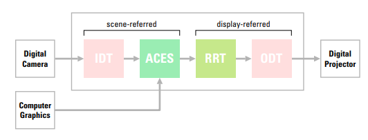

# Academy Color Encoding System (ACES)

[Selan Jeremy](./WorksCited.md/#works-cited) perhaps gives the best concise ACES explanation:

> **__NOTE__**: [Chris Brejon](./WorksCited.md/#works-cited) has a more thorough article that discusses the ins and outs of ACES [here](https://chrisbrejon.com/cg-cinematography/chapter-1-5-academy-color-encoding-system-aces/). Though he does mention in later posts that after further experience with ACES, he failed to address the present day downfalls of ACES accurately. Nevertheless it's a great resource for a clear description of all the ACES processes.

"The Academy of Motion Picture Arts & Science has proposed a unification of [scene-linear](./Glossary.md/#linear-ambiguous) floating-point workflows, which adheres to many of the approaches outlined in this document. If successful, the ACES project will allow for the unambiguous interchange of floating point imagery. At its core is the Academy Color Encoding Space, called ACES for short. This color space is a [high-dynamic range](./Glossary.md/#high-dynamic-range-image-hdr), [scene-linear](./Glossary.md/#linear-ambiguous) space, with middle gray pegged to 0.18, and a very wide color gamut. When stored on disk, aces files are stored in a constrained version of the OpenEXR format."

 

 

"The Academy also defines the [viewing transform](./Glossary.md/#display-transform) necessary for viewing ACES files. The [view transform](./Glossary.md/#display-transform) is conceptually segmented into two portions. First, the Reference Rendering Transform (RRT) applies a local contrast boost and tone-renders [scene-linear](./Glossary.md/#linear-ambiguous) imagery to [display linear](./Glossary.md/#linear-ambiguous). Then, a second portion of the [view transform](./Glossary.md/#display-referred-image) called the Output Device Transform (ODT) is used to provide [gamut](./Glossary.md/#gamut) mapping and further tone mapping to the target output device. The RRT portion is constant across all displays, but the ODT varies from output display device to output display device. ODTs are provided for common display specifications such as sRGB, Rec. 709, DCI-P3, X’Y’Z’, etc.

On the input side, a series of published input device transforms (IDTs) for specific image acquisition devices convert input colorimetry to [scene-linear](./Glossary.md/#linear-ambiguous) (ACES). Film scans are a special case, where the academy has defined a new density encoding standard, the Academy Density Encoding (ADX), which is typically stored in a DPX file. Both 10 and 16 bit flavors of ADX are provided, which encode for different negative density ranges. The academy input transform for film negatives is not stock specific, but relies on a generic film input linearization.

In the ACES workflow, the intent is for artistic changes to be made by manipulating the aces data, as viewed through the RRT + ODT. All of the transforms (both input and output) for ACES have a reference implementation defined using the Color Transformation Language (CTL); contributed by Industrial Light & Magic. CTL is an interpreted language similar in spirit to shader languages commonly used in renderers, but with a focus on color transforms. CTL provides a rich color correction API, including scattered data interpolation. CTL is run independently per pixel, and is thus suitable for baking into 1D/ 3D [LUTs](./Glossary.md/#lookup-table-lut) - allowing for real-time “baked” performance. Unfortunately though, CTL transforms are not currently supported natively on most platforms so current practice is to bake their logic into platform specific operations and/or 3D-LUTs." -[Selan Jeremy](./WorksCited.md/#works-cited)

## ACES Weakness
ACES downfall is that the "ACES look" is baked into its viewing transforms and cannot be opt out of. That is not to say it isn't desired, but to override the "ACES look", a proprietary display transform is required. For this reason, ACES has generally become the standard format to delivery plates across VFX Houses, but proprietary viewing transforms are applied for final display.