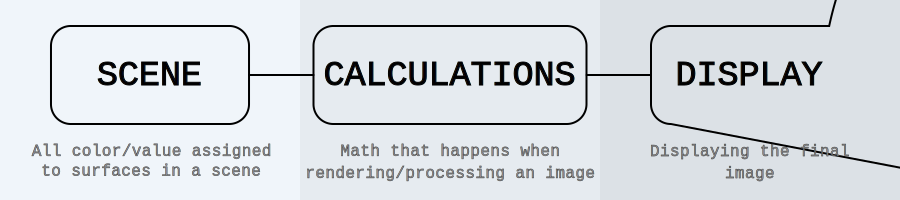
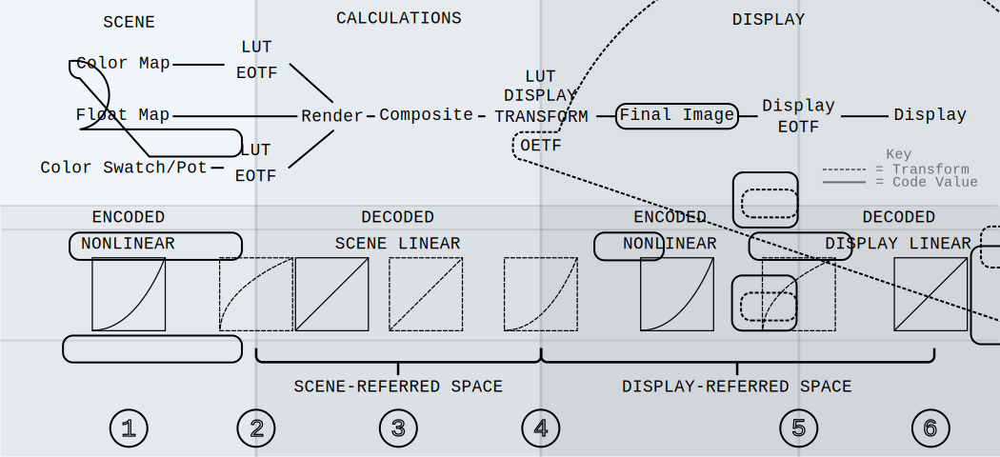

# Color Management Workflow

[Color](./Glossary.md/#color) is light, so a [Color Management Workflow](./Glossary.md/#color-management-workflow) is the workflow of capturing light in a scene, artistically manipulating the light, and accurately emitting the light from a display. 
> **_Note_**: The workflows discussed are comparable to using a camera, but this research focuses on computer generated scenes in an animation pipeline. Additionally, this research refers to monitors when discussing displays, but (to the best of my knowledge) displays can be considered any output device (i.e. printer, projector).

## CMW Pipeline:
1. Artists use [texture maps](./Glossary.md#texture-map) and [DCC](./Glossary.md#digital-content-creation-dcc) [color swatches](./Glossary.md/#color-swatchpot) (or input colors) to define scene colors. When created these “input colors” are viewed with a [display transform](./Glossary.md/#display-transform), but the [display transform](./Glossary.md/#display-transform) is not baked into the data at export. Additionally, input colors are [nonlinear](./Glossary.md/#nonlinear) [decoded](./Glossary.md/#decode) values in any given [color space](./Glossary.md/#color-space).
> **_Note_**: It is critical to know a scene’s  [texture maps’](./Glossary.md/#texture-map) and [color swatches’](./Glossary.md/#color-swatchpot) [color spaces](./Glossary.md/#color-space) for proper [encoding](./Glossary.md/#encode) in step 2.

2. [Texture maps](./Glossary.md/#texture-map) and [color swatches](./Glossary.md/#color-swatchpot) are [decoded](./Glossary.md/#decode) through an [opto-electronic transfer function (OETF)](./Glossary.md/#transfer-function), and converted to [scene-linear values](./Glossary.md/#linear-ambiguous). To convert input colors to [scene-linear values](./Glossary.md/#linear-ambiguous) there is generally a more elaborate [LUT](./Glossary.md/#lookup-table-lut) required (especially if you are rendering in a different [color space](./Glossary.md/#color-space) then the input colors exist in); however, it isn’t unfair to describe the required transform as an invert of the display [EOTF](./Glossary.md/#transfer-function). 

> **_See_**: [Transfer Functions Page](./TransferFunctions.md) for additional clarification.

3. Rendering and compositing calculations should always be computed in [scene-linear values](./Glossary.md/#scene-referred-encoding). [Scene-linear values](./Glossary.md/#scene-referred-encoding) are not suitable for viewing, but contain all the proper data for the final image. You must use a [display transform](./Glossary.md/#display-transform) to view [HDR](./Glossary.md/#high-dynamic-range-image-hdr) [scene-linear](./Glossary.md/#linear-ambiguous) data correctly.
> **_Note_**: [Linear](./Glossary.md/#linear-ambiguous) is often misunderstood to be a [color space](./Glossary.md/#color-space) or to mean infinite [gamut](./Glossary.md/#gamut). This is incorrect. [Linear](./Glossary.md/#linear-ambiguous) values still exist within a [color space](./Glossary.md/#color-space) with respective [primaries](./Glossary.md/#primaries), and should always be described as [scene-linear](./Glossary.md/#linear-ambiguous) or [display-linear](./Glossary.md/#linear-ambiguous).

4. [Scene-linear](./Glossary.md/#scene-referred-encoding) composited images are [encoded](./Glossary.md/#encode) into [nonlinear](./Glossary.md/#nonlinear) values using a critical [display transform](./Glossary.md/#display-transform) and  [electro-optical transfer function (EOTF)](./Glossary.md/#transfer-function); which are often cached in a [LUT](./Glossary.md/#lookup-table-lut). It is important to note that the [LUT](./Glossary.md/#lookup-table-lut) is always dependent on the display device and environment.
> **_See_**: [Display Transform](./DisplayTransform.md) and [Transfer Functions Page](./TransferFunctions.md) for additional clarification.

5. Step 4 accomplishes two goals…  
> 1. All displays contain a proprietary [OETF](./Glossary.md/#transfer-function) used right before light emission. An [OETF](./Glossary.md/#transfer-function) converts [nonlinear](./Glossary.md/#nonlinear) [decoded](./Glossary.md/#decode) values into a [display-linear data](./Glossary.md/#display-referredoutput-referred-encoding).
**_Note_**: If you feed the display [scene-referred values](./Glossary.md/#scene-referred-encoding) without a [display transform](./Glossary.md/#display-transform) or [OETF](./Glossary.md/#transfer-function) function it will still perform its proprietary [OETF](./Glossary.md/#transfer-function) and the emitted light will be incorrect.  
> 2. Significant compression and optimization gains occur by running an [OETF](./Glossary.md/#transfer-function) and [EOTF](./Glossary.md/#transfer-function) in tandem.

6. If the final render image is transformed correctly it’ll be accurately compressed, in the correct [color space](./Glossary.md/#color-space), and decoded into [display-linear](./Glossary.md/#linear-ambiguous) values to emit the correct light from the display.