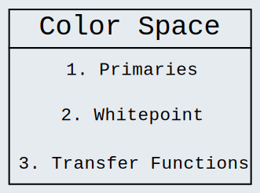
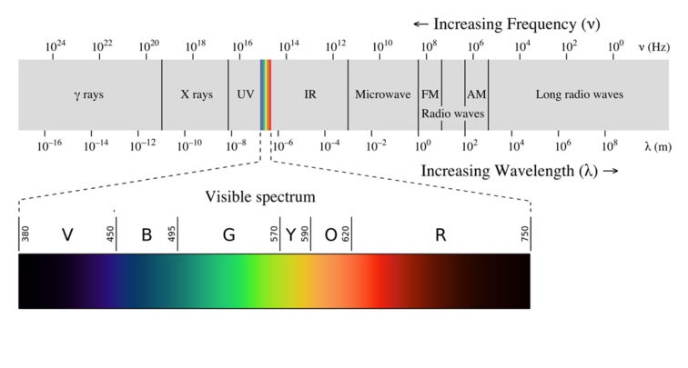
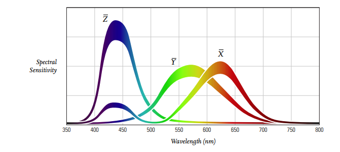
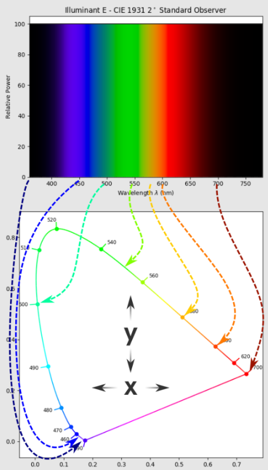
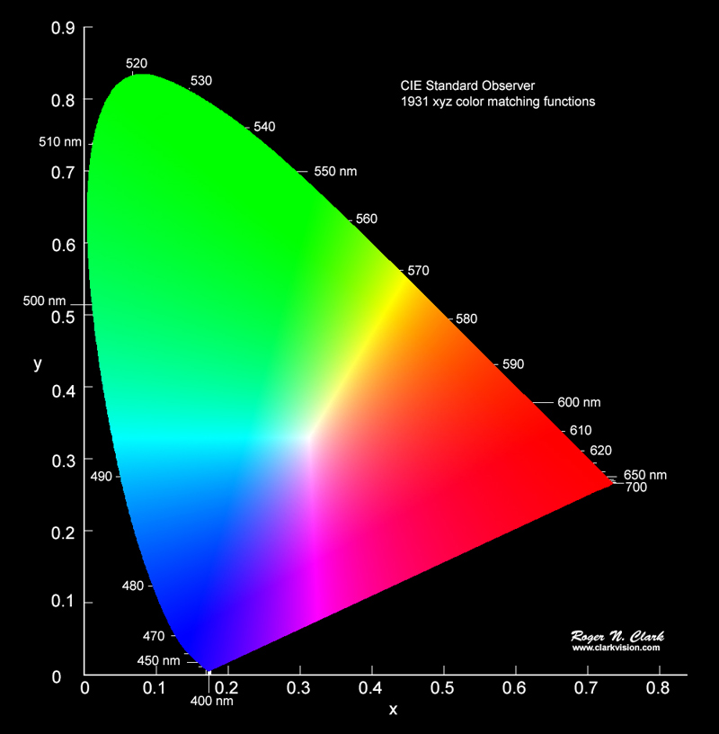
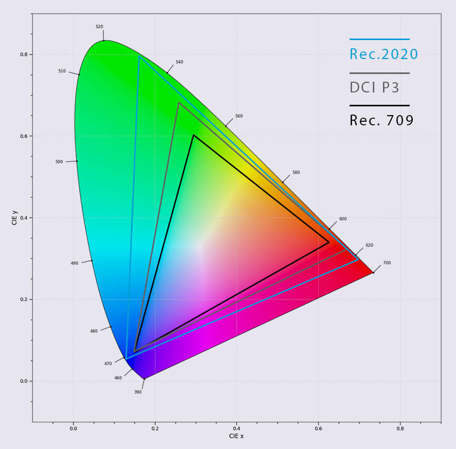
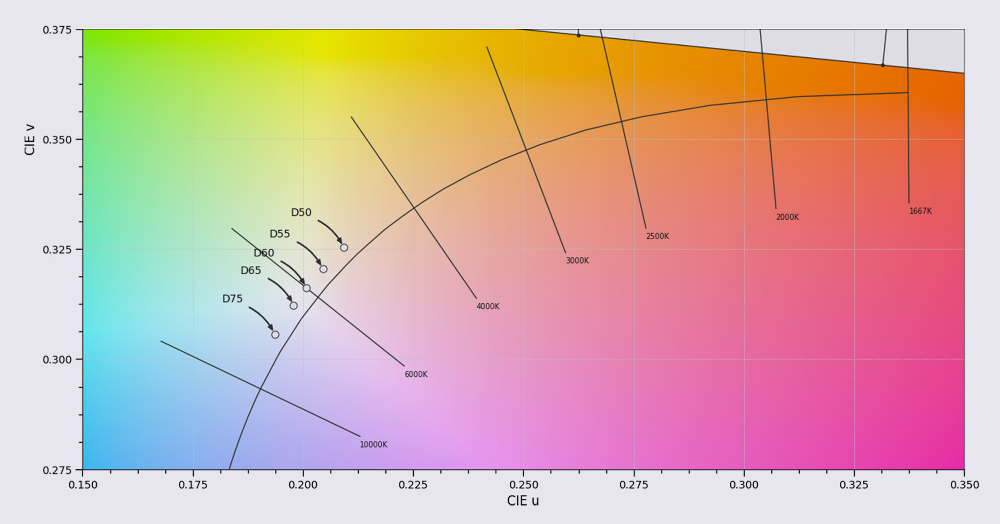
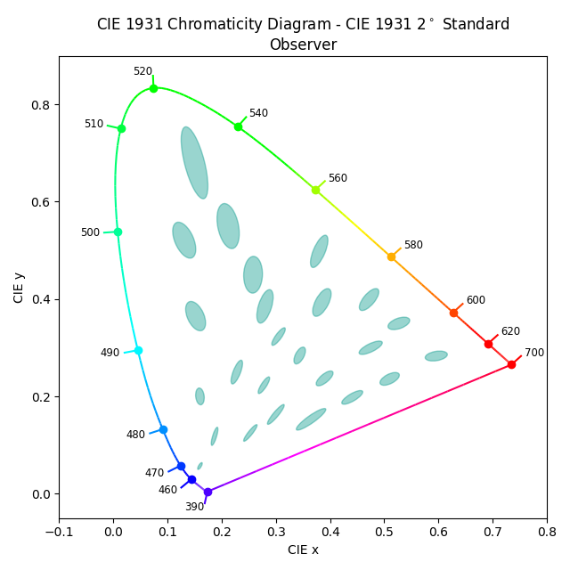
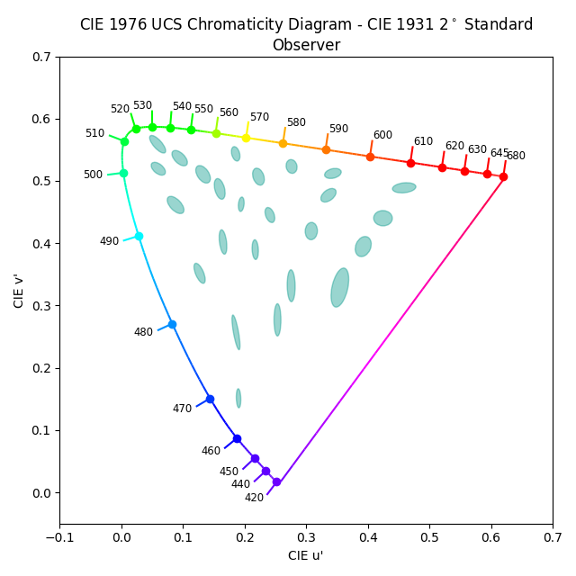

# Color Space

    <table>
	    <tr>
    	    <td style="padding:10px">
        	    
            </td>
        </tr>
    </table>

## Color Space History

[Color](./Glossary.md/#color) is a psychological phenomena. The experience of [color](./Glossary.md/#color) is tightly wound between physical stimuli and complex human psychological and organic reactions. Therefore, color is relative to any given context. So we need a method of quantifying light, and discussing color in a meaningful way.

    <table>
	    <tr>
    	    <td style="padding:10px">
        	    
      	    </td>
            <td style="padding:10px">
            	
            </td>
        </tr>
    </table>

"The [human visual system](./Glossary.md/#human-perceptual-system) [...] is trichromatic. Thus, color can be fully specified as a function of three variables. Through a series of perceptual experiments, the color community has derived three curves, the CIE 1931 color matching functions, which allow for the conversion of spectral energy into measure of color" ([Cinematic Color](./WorksCited.md)).

    <table>
	    <tr>
    	    <td style="padding:10px">
        	    
      	    </td>
            <td style="padding:10px">
            	
            </td>
        </tr>
    </table>

Additionally in 1931, the CIE 1931 color matching functions were refactored into a [chromaticity diagram](./Glossary.md/#cie-1931-color-space-model). This diagram is essential to defining [chromaticity](./Glossary.md/#chromaticity), and visualizing [color spaces](./Glossary.md/#color-space). 
Key attributes of the diagram are:
1. Everything inside the horse-shoe shape represents all possible colors of visible [radiant energy](./Glossary.md/#radiant-energy-radiance)
2. Every [chromaticity](./Glossary.md/#chromaticity) can be defined by a unique coordinate on the diagram.
3. [Spectrum Locus](./Glossary.md/#spectrum-locus): it is the infinitely thin, horseshoe shaped, line that represents all of the colors of the visible spectrum.
> a. The [locus](./Glossary.md/#spectrum-locus) represents the most heavily saturated isolated light hue a standard observer can see.  
> b. The straight line at the bottom of the horse shoe shape represents a light hue that cannot be created from a single spectral wavelength (i.e. purple)

> **_Note_**: It's not particularly important to know how these diagrams were derived, but knowing the general development of where today's recognized [chromaticity diagram](./Glossary.md/#cie-1931-color-space-model) came from can be helpful.  
It’s important to know that this model is a top down view of a 3-axis graph. The missing axis is [luminance](./Glossary.md/#luminance), which is the perceptual intensity of color.

## Color Space Components

    <table>
	    <tr>
    	    <td style="padding:10px">
        	    
            </td>
        </tr>
    </table>

A [color space](./Glossary.md/#color-space) is made of three components:

1. **[Primaries](./Glossary.md/#primaries)**: three unique [chromaticities](./Glossary.md/#chromaticity) that define the [gamut](./Glossary.md/#gamut) within a given [color space](./Glossary.md/#color-space). The primaries will always define the [color](./Glossary.md/#color) of red, green, and blue in a given [color space](./Glossary.md/#color-space).

    <table>
	    <tr>
    	    <td style="padding:10px">
        	    
            </td>
        </tr>
    </table>

2. **[Whitepoint](./Glossary.md/#whitepoint)**: the [chromaticity](./Glossary.md/#chromaticity) in a [color space](./Glossary.md/#color-space) that defines “white” to the standard viewer. Any set of [chromaticities](./Glossary.md/#chromaticity) lying on the neutral axis passing through the [whitepoint](./Glossary.md/#whitepoint), will be neutral to that color space.
> **_See_**: [white](./Glossary.md/#white) for additional information.

3. **[Transfer Functions](./Glossary.md/#transfer-function)**: formulas that describe how code values relate to light energy inputs or outputs.
> **_See_**: [Transfer Functions Page](./TransferFunctions.md) for additional clarification.

> **_Note_**: unfortunately people often confuse a single part of any given [color space](./Glossary.md/#color-space) to be the entirety of a [color space](./Glossary.md/#color-space). When discussing this topic clarity is key.

## General [Color Space](./Glossary.md/#color-space) Standards:
- **sRGB**: for internet, Windows, camera photos
- **Rec.709**: for videos viewed in a dim environment (same primaries as sRGB)
- **DCI-P3**: for cinema Projectors
- **AdobeRGB**: for printing

## Additional Information
> **_Note_**: This next bit of information is not necessary for understanding and analyzing [color spaces](./Glossary.md/#color-space), but nonetheless, may still be useful for a holistic understanding of [color spaces](./Glossary.md/#color-space).

### [Perceptually Uniform](./Glossary.md/#perceptually-uniform)

The [CIE 1931 Color Space Model](./Glossary.md/#cie-1931-color-space-model) is a [linear](./Glossary.md/#linear-ambiguous) plot. That is, the plot is [radiometrically uniform](./Glossary.md/#radiometrically-uniform) with respect to an observer. However, just as observers don’t experience a [linear](./Glossary.md/#linear-ambiguous) relationship with the [radiometric intensities](./Glossary.md/#radiometric-light-energy) of light, they don’t with “hue” and “saturation” as well. In other words the [CIE 1931 Model](./Glossary.md/#cie-1931-color-space-model) is not [perceptually uniform](./Glossary.md/#perceptually-uniform).

    <table>
	    <tr>
    	    <td style="padding:10px">
        	    
      	    </td>
            <td style="padding:10px">
            	
            </td>
        </tr>
    </table>

In 1976, the [CIE 1976 Color Space Model](./Glossary.md/#cie-1976-color-space-model) (left) was created in an attempt to make the [1931 model](./Glossary.md/#cie-1931-color-space-model) (right) more [perceptually uniform](./Glossary.md/#perceptually-uniform), by non-uniformly, scaling the [1931 model](./Glossary.md/#cie-1931-color-space-model). It is recognized as a valid model, but habit has left the [1931 model](./Glossary.md/#cie-1931-color-space-model) as the standard.

### White
[White](./Glossary.md/#white) is a mixture of visible lights that our [perceptual system](./Glossary.md/#human-perceptual-system) has fully adapted to. It can be expressed on the [CIE 1931 chromaticity plot](./Glossary.md/#cie-1931-color-space-model).  

[White](./Glossary.md/#white) is a mixture of visible spectra, but appears to be without color, or achromatic. It exemplifies a psychological bit of magic around [perceptual chromatic adaptation](./Glossary.md/#human-perceptual-system). When our [perceptual systems](./Glossary.md/#human-perceptual-system) adapt to a neutral achromatic axis it does something truly remarkable; it shifts, bends, warps, and adjusts every single spectral combination in our field of view. In other words, the entire rest of our color sensation will be skewed to that adaptation.