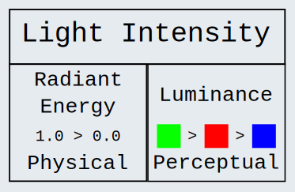

# LightIntensity

In short, to convert a color image to grayscale, you can't solely measure the [radiant energy](../Glossary.md/#radiant-energy-radiance) code values; you must additionally use math to take into account [luminance](../Glossary.md/#luminance) as well.

 

There are two useful axes to discuss the [intensity](../Glossary.md/#light-intensity) of light:
1. [Radiant Energy](../Glossary.md/#radiant-energy-radiance): the physical energy value of light.
2. [Luminance](../Glossary.md/#luminance): the perceptual [intensity](../Glossary.md/#light-intensity) of [color](../Glossary.md/#color).