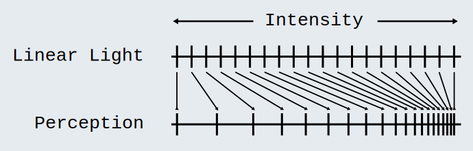
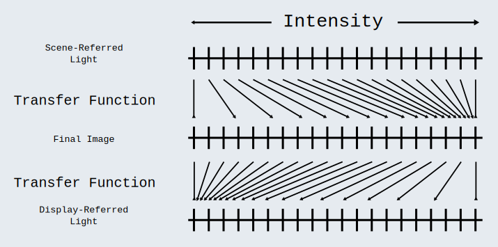

# Transfer Functions

**_Transfer Function_**: or color component [transfer function](./Glossary.md/#transfer-function), is a math formula that describes how code values relate to light energy input or output. They are the “Rosetta Stone” between code values and physical quantities of light.
> **_Note_**: A [color space](./Glossary.md/#color-space)’s [whitepoint](./Glossary.md/#whitepoint) is the direct result of [transfer functions](./Glossary.md/#transfer-function). Additionally, [transfer functions](./Glossary.md/#transfer-function) have no effect on a code value’s [chromaticity](./Glossary.md/#chromaticity), only it’s intensity. [Transfer functions](./Glossary.md/#transfer-function) can convert [HDRI](./Glossary.md/#high-dynamic-range-image-hdri) to [LDRI](./Glossary.md/#low-dynamic-range-image-ldri), and vice versa.

In the [Color Management Workflow Page](./CMW.md) it explains that rendering should be performed with [linear](./Glossary.md/#linear-ambiguous) code values, display light emission is always [linear](./Glossary.md/#linear-ambiguous), and modern LED displays are [linear](./Glossary.md/#linear-ambiguous) in regards to current input and light output. So why ever use nonlinear code values?

 

## Code Value Compression

“If we strictly used [linear](./Glossary.md/#linear-ambiguous) light, plenty of those values would be “wasted” in the final image; our [perceptual system](./Glossary.md/#human-perceptual-system) wouldn’t bother to differentiate between some of the values, and we’d barely be able to see the differences, if at all, in some of the range of the values. Plenty of the [linear](./Glossary.md/#linear-ambiguous) light values towards the right side of our measurements would end up collapsed into an identical looking [perceptual system](./Glossary.md/#human-perceptual-system) experience. While the image would display perfectly fine on our mythical [linear](./Glossary.md/#linear-ambiguous) light display, the additional code values might as well not be there if the intention is to optimize the [encoding](./Glossary.md/#encode)!” ([Sobotka](./WorksCited.md)).

 

Using a [transfer function](./Glossary.md/#transfer-function) on [nonlinearly](./Glossary.md/#nonlinear) code values in accordance with a [display-referred output](./Glossary.md/#display-referredoutput-referred-encoding) is nothing more than a compression scheme; it removes code values from the range of values that are redundant for our [perceptual systems](./Glossary.md/#human-perceptual-system).

## Transfer Function Types

There are many types of [transfer functions](./Glossary.md/#transfer-function) that facilitate different needs.
> **_See_**: [EOTF](./Glossary.md/#transfer-function), [OETF](./Glossary.md/#transfer-function)  
What others exist?

>**_Note_**: It’s important to note that [gamma](./Glossary.md/#gamma-ambiguous) is, unfortunately, used as an umbrella term for [transfer functions](./Glossary.md/#transfer-function). Though [gamma](./Glossary.md/#gamma-ambiguous) may perform similar operations as some [transfer functions](./Glossary.md/#transfer-function), it significantly hides the larger functionality of [transfer functions](./Glossary.md/#transfer-function) in general.